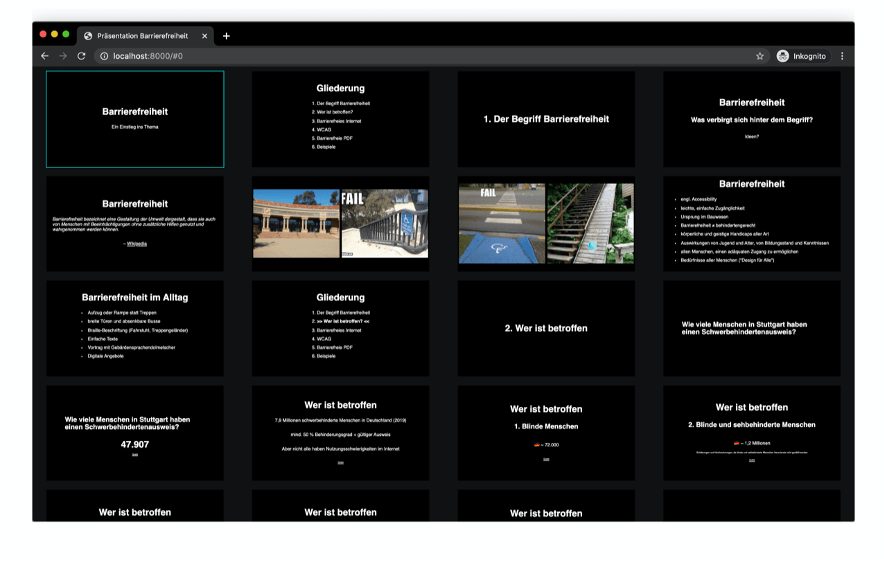

# A11y - Slides

German presentation on the topic "Accessibility

[https://a11y-slides.vercel.app/](https://a11y-slides.vercel.app/)

Based on [mdx-deck](https://github.com/jxnblk/mdx-deck)

## Keyboard Shortcuts

- Option + P == Toggle Presenter Mode
- Option + O == Toggle Overview Mode
- Option + G == Toggle Grid Mode

## Helpful Links

- [https://github.com/josefaidt/mdx-deck-theme-garlic](https://github.com/josefaidt/mdx-deck-theme-garlic)
- [https://medium.com/@jsilvafour/a-laymans-guide-to-mdx-decks-36a6b0587095](https://medium.com/@jsilvafour/a-laymans-guide-to-mdx-decks-36a6b0587095)
- [https://github.com/SaraVieira/99-problems-graphql-aint-one/blob/master/deck.mdx](https://github.com/SaraVieira/99-problems-graphql-aint-one/blob/master/deck.mdx)
