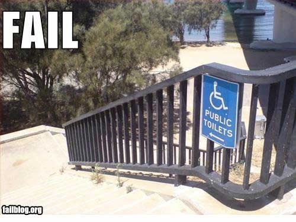
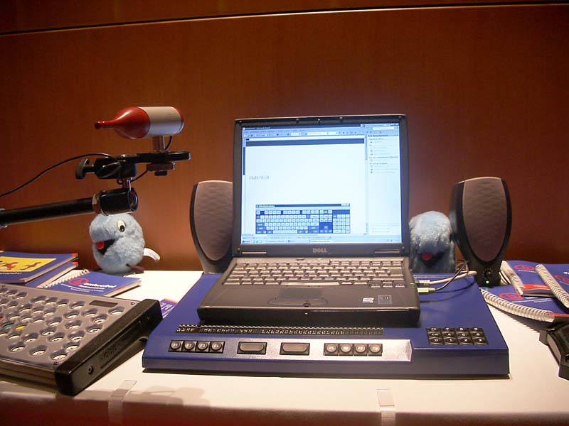
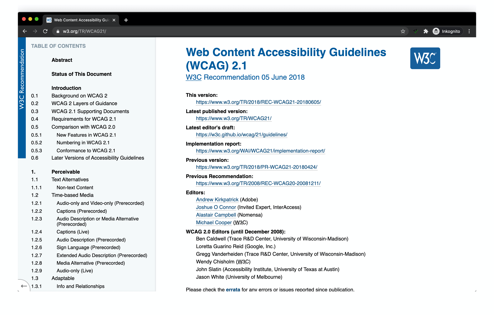
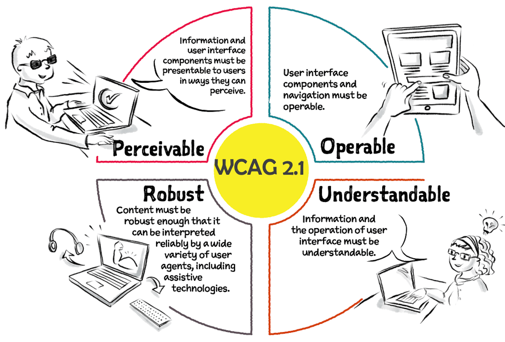
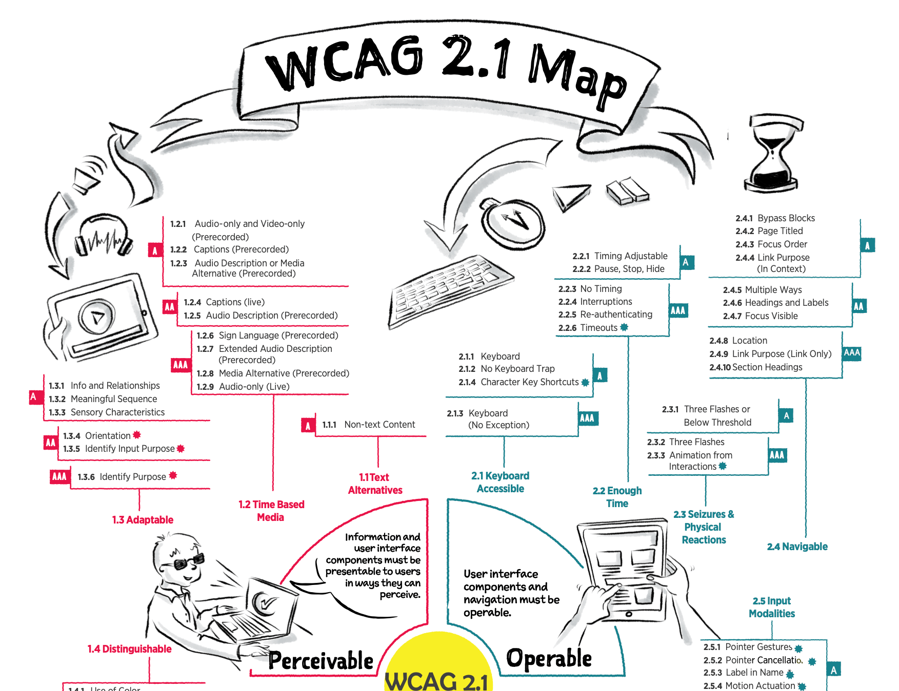
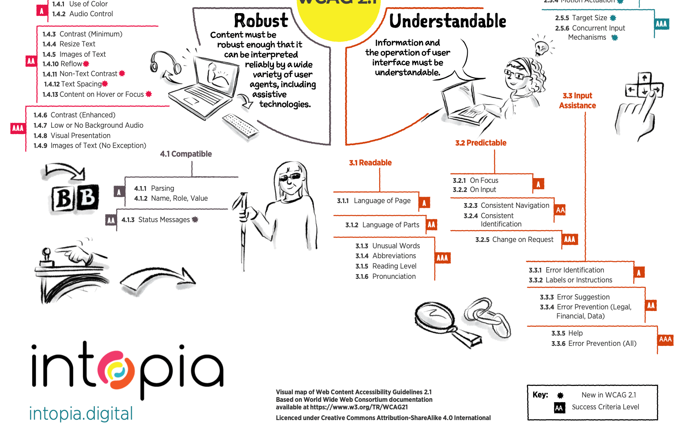
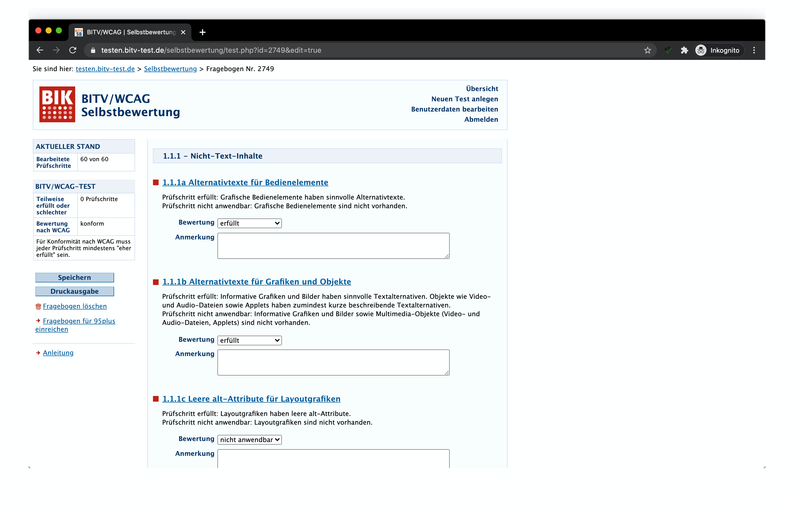

import { Flex, Box, Heading, Text, Link } from 'theme-ui';
import myTheme from './theme';
// import myTheme from './print'; << Use this for Printer-frindly Layout
export const theme = myTheme;

import screenreader from './videos/NVDA-Screenreader-Tim-Berners-Lee-W3C.mp4';
import screenreadercover from './videos/NVDA-Screenreader-Tim-Berners-Lee-W3C_cover.png';

import eu2102website from './images/eu2102-website.png';

import examplepdfinhaltsverzeichnis from './images/examplepdf-inhaltsverzeichnis.png';
import examplepdftext1 from './images/examplepdf-text1.png';
import examplepdftext2 from './images/examplepdf-text2.png';
import examplepdflayout1 from './images/examplepdf-layout1.png';
import examplepdflayout2 from './images/examplepdf-layout2.png';

import examplealtattributes1 from './images/example-altattributes1.png';
import examplealtattributes2 from './images/example-altattributes2.png';
import examplecontrast from './images/example-contrast.png';
import exampledisabledstyles from './images/example-disabledstyles.png';
import examplefocus from './images/example-focus.png';
import exampleform from './images/example-form.png';
import exampleheadings from './images/example-headings.png';
import examplelandmarks from './images/example-landmarks.png';
import exampletextabstaende from './images/example-textabstaende.png';

# Barrierefreiheit

Ein Einstieg ins Thema

---

# Gliederung

1. Der Begriff Barrierefreiheit
2. Wer ist betroffen?
3. Barrierefreies Internet
4. WCAG
5. Barrierefreie PDF
6. Beispiele

---

# 1. Der Begriff Barrierefreiheit

---

# Barrierefreiheit

## Was verbirgt sich hinter dem Begriff?

Ideen?

---

# Barrierefreiheit

> Barrierefreiheit bezeichnet eine Gestaltung der Umwelt dergestalt, dass sie auch von Menschen mit Beeinträchtigungen ohne zusätzliche Hilfen genutzt und wahrgenommen werden können.

– [Wikipedia](https://de.wikipedia.org/wiki/Barrierefreiheit)

---

---

---

# Barrierefreiheit

- engl. [Accessibility](https://developer.mozilla.org/en-US/docs/Web/Accessibility?retiredLocale=de) (oft abgekürzt als: A11y)
- leichte, einfache Zugänglichkeit
- Ursprung im Bauwesen
- Barrierefreiheit ≠ behindertengerecht
- körperliche und geistige Handicaps aller Art
- Auswirkungen von Jugend und Alter, von Bildungsstand und Kenntnissen
- allen Menschen, einen adäquaten Zugang zu ermöglichen
- Bedürfnisse aller Menschen ("Design für Alle")

---

# Barrierefreiheit im Alltag

- Aufzug oder Rampe statt Treppen
- breite Türen und absenkbare Busse
- Blindenschrift-Beschriftung Braille (Fahrstuhl, Treppengeländer)
- Einfache Texte
- Vortrag mit Gebärdensprachendolmetscher
- Digitale Angebote

---

# Gliederung

1. Der Begriff Barrierefreiheit
2. **>> Wer ist betroffen? <<**
3. Barrierefreies Internet
4. WCAG
5. Barrierefreie PDF
6. Beispiele

---

# 2. Wer ist betroffen

---

Wie viele Menschen in Stuttgart haben einen Schwer&shy;behinderten&shy;ausweis?

---

Wie viele Menschen in Stuttgart haben einen Schwer&shy;behinderten&shy;ausweis?

# 47.907

[Quelle](https://www.stuttgart.de/service/aktuelle-meldungen/oktober-2020/beauftragte-fuer-die-belange-von-menschen-mit-behinderung-stellt-jahresbericht-2019-vor.php)

---

# Wer ist betroffen

7,9 Millionen schwerbehinderte Menschen in Deutschland (2019)

mind. 50 % Behinderungsgrad + gültiger Ausweis

Aber nicht alle haben Nutzungsschwierigkeiten im Internet

[Quelle](https://www.destatis.de/DE/Presse/Pressemitteilungen/2020/06/PD20_230_227.html)

---

# Wer ist betroffen

## 1. Blinde Menschen

🇩🇪 ~ 72.000

[Quelle](https://www.rehadat-statistik.de/statistiken/behinderung/behinderungsarten/blindheit-und-sehbehinderung)

---

# Wer ist betroffen

## 2. Blinde und sehbehinderte Menschen

🇩🇪 ~ 1,2 Millionen

Schätzungen und Hochrechnungen, da blinde und sehbehinderte Menschen hierzulande nicht gezählt werden

[Quelle](https://www.rehadat-statistik.de/statistiken/behinderung/behinderungsarten/blindheit-und-sehbehinderung)

---

# Wer ist betroffen

## 3. Gehörlose Menschen

🇩🇪 ~ 83.000 Millionen

hochgradig hörbehindert oder gehörlos

[Quelle](https://www.gehoerlosen-bund.de/sachthemen/statistik%20der%20geh%C3%B6rlosen%20menschen)

---

# Wer ist betroffen

## 3. Schwerhörige Menschen

🇩🇪 ~ 15,6 Millionen

Menschen, die nicht mehr gut hören können und früher oder später auf akustische Hilfsmittel angewiesen sind.

[Quelle](https://www.audibene.de/hoerverlust-in-deutschland)

---

# Wer ist betroffen

## 4. Menschen mit eingeschränkter Motorik

🇩🇪 ~ 1,5 Millionen mit rheumatischen Erkrankungen.

[Quelle](https://dgrh.de/Start/DGRh/Presse/Daten-und-Fakten/Rheuma-in-Zahlen.html)

---

# Wer ist betroffen

## 5. Menschen mit kognitiven Beeinträchtigungen

Menschen mit geistigen oder seelischen Behinderungen; Menschen mit einer Leseschwäche

---

# Wer ist betroffen

## 6. Alle

Ältere Menschen, Mobile-Nutzer, Nicht-Muttersprachler

Etwa jeder Zweite ab 65 Jahren nutzt das Internet

---

# Gliederung

1. Der Begriff Barrierefreiheit
2. Wer ist betroffen?
3. **>> Barrierefreies Internet <<**
4. WCAG
5. Barrierefreie PDF
6. Beispiele

---

# Barrierefreies Internet

---

# Barrierefreies Internet

Menschen mit Behinderungen

- sind überdurchschnittlich häufig im Internet
- angewisen auf spezielle Aufbereitung
- nutzen Hilfstechnologien

---

# Barrierefreies Internet

Auch für nichtbehinderte Nutzer

- technische Barrierefreiheit / Plattformunabhängigkeit
- angepasste Anforderungen an Bildung und Ausbildung

---

# Barrierefreies Internet

## Screenreader Demo

<video src={screenreader} poster={screenreadercover} controls preload></video>

---

# Barrierefreies Internet

## Hilfstechnologien

[Quelle](https://de.wikipedia.org/wiki/Barrierefreies_Internet#/media/Datei:Biene2004-29.jpg)

---

# Vorteile von barrierefreiem Internet

- Zielgruppe erweitern
- Einfache Bedienbarkeit für alle
- Mobile Nutzung
- Suchmaschinenoptimierung
- Hohe technische Standards
- Zukunftsorientierung
- …

---

# Beispiele

Die uns alle betreffen...

- schlechter Kontrast
- zu kleine Buttons
- schlechtes Fehler-Feedback bei Formularen
- inkonsistentes Menü
- Autoplay Videos mit Sound
- Tastaurbedienung (Pause bei Videos)
- …

---

# Beispiele

aber auch das kann dazu gehören

- Text-Alternativen für Nicht-Text-Inhalte
- Alternativen für Zeit-basierte Medien
- Untertitel bei Videos
- Audiodeskrition bei Videos
- Diagramme
- Interaktive Karten
- Erklärungen in Gebärdensprachen
- Erklärungen in Leicher Sprache
- …

---

# Gesetze & Richtlinien

[EU-Richtlinie 2016/2102](https://eur-lex.europa.eu/legal-content/DE/TXT/?uri=CELEX%3A32016L2102)

[Gesetz zur Gleichstellung von Menschen mit Behinderungen (BGG)](https://www.gesetze-im-internet.de/bgg/BJNR146800002.html)

[Landesgesetz zur Gleichstellung von Menschen mit Behinderungen (L-BGG)](http://www.landesrecht-bw.de/jportal/?quelle=jlink&query=BehGleichStG+BW&psml=bsbawueprod.psml&max=true&aiz=true)

[Barrierefreie-Informationstechnik-Verordnung (BITV 2.0)](https://www.gesetze-im-internet.de/bitv_2_0/BJNR184300011.html)

[Web Content Accessibility Guidelines (WCAG)](https://www.w3.org/Translations/WCAG20-de/)

---

# EU-Richtlinie 2016/2102

[Quelle](https://eur-lex.europa.eu/legal-content/DE/TXT/HTML/?uri=CELEX:32016L2102&from=DE)

---

# EU-Richtlinie 2016/2102

## Artikel 12 (3) - Umsetzung

- a) auf Websites öffentlicher Stellen, die nicht vor dem 23. September 2018 veröffentlicht wurden: ab dem 23. September 2019;
- b) auf alle Websites öffentlicher Stellen, die nicht unter Buchstabe a fallen: ab dem 23. September 2020;
- c) auf mobile Anwendungen öffentlicher Stellen: ab dem 23. Juni 2021.

▶️ öffentliche Stellen der Bundes-, Landes- und kommunalen Ebene

---

# EU-Richtlinie 2016/2102

## Artikel 2 (1) Nr. 4 - Begriffsbestimmungen

„Einrichtungen des öffentlichen Rechts“ Einrichtungen mit sämtlichen der folgenden Merkmale:

- a) Sie wurden zu dem besonderen Zweck gegründet, im Allgemeininteresse liegende Aufgaben nicht gewerblicher Art zu erfüllen,
- b) sie besitzen Rechtspersönlichkeit und
- c) sie werden überwiegend vom Staat, von Gebietskörperschaften oder von anderen Einrichtungen des öffentlichen Rechts finanziert […]

[Quelle](https://eur-lex.europa.eu/legal-content/DE/TXT/?uri=CELEX:32014L0024)

---

# EU-Richtlinie 2016/2102

## Artikel 1 - Gegenstand und Anwendungsbereich

(4) Diese Richtlinie gilt **nicht** für die folgenden Inhalte von Websites und mobilen Anwendungen:
- a) Dateiformate von Büroanwendungen, die vor dem 23. September 2018 veröffentlicht wurden, […]
- b) aufgezeichnete zeitbasierte Medien, die vor dem 23. September 2020 veröffentlicht wurden;

Dateiformate von Büro-Anwendungen sind zu verstehen als Dokumente, die nicht in erster Linie für die Verwendung im Internet gedacht sind und die in Websites enthalten sind, wie z. B. Dokumente in Adobe Portable Document Format (PDF), Microsoft-Office- oder (quelloffenen) gleichwertigen Formaten.

---

# EU-Richtlinie 2016/2102

## Artikel 7 - Zusätzliche Maßnahmen

> (1) Die Mitgliedstaaten stellen sicher, dass öffentliche Stellen eine detaillierte, umfassende und klare Erklärung zur Barrierefreiheit über die Vereinbarkeit ihrer Websites und mobilen Anwendungen mit dieser Richtlinie bereitstellen und diese regelmäßig aktualisieren.

---

# EU-Richtlinie 2016/2102

## Artikel 9 - Durchsetzungsverfahren

> (1) Die Mitgliedstaaten gewährleisten die Verfügbarkeit eines angemessenen und wirksamen Durchsetzungsverfahrens, um die Einhaltung dieser Richtlinie in Bezug auf die Anforderungen in Artikel 4, Artikel 5 und Artikel 7 Absatz 1 zu gewährleisten.

---

# EU-Richtlinie 2016/2102

## Schlichtungsverfahren

> […], können Sie sich an die Schlichtungsstelle nach § 16 BGG wenden. Die Schlichtungsstelle BGG hat die Aufgabe, bei Konflikten zum Thema Barrierefreiheit zwischen Menschen mit Behinderungen und öffentlichen Stellen eine außergerichtliche Streitbeilegung zu unterstützen.

[Quelle](https://www.stuttgart.de/buergerinnen-und-buerger/menschen-mit-behinderung/barrierefrei-in-stuttgart/Barrieren-melden.php)

---

# BITV

> Verordnung zur Schaffung barrierefreier Informationstechnik nach dem Behindertengleichstellungsgesetz

Zuletzt geändert am 21.05.2019

Gültig auf Bundesebene. Bundesländer haben eigene Bestimmungen.

[Quelle](https://www.gesetze-im-internet.de/bitv_2_0/BJNR184300011.html)

---

# BITV

## § 1 Ziele

> (1) Die Barrierefreie-Informationstechnik-Verordnung dient dem Ziel, eine umfassend und grundsätzlich uneingeschränkt barrierefreie Gestaltung moderner Informations- und Kommunikationstechnik zu ermöglichen und zu gewährleisten.

---

# BITV

## § 2 Anwendungsbereich

[Gekürzt] gilt für folgende Angebote, Anwendungen und Dienste: Websites, mobile Anwendungen, elektronisch unterstützte Verwaltungsabläufe, grafische Programmoberflächen, die […] von den öffentlichen Stellen zur Nutzung bereitgestellt werden.

---

# BITV

## § 4 Erläuterungen in Deutscher Gebärdensprache und Leichter Sprache

> Auf der Startseite einer Website einer öffentlichen Stelle sind nach Anlage 2 folgende Erläuterungen in Deutscher Gebärdensprache und in Leichter Sprache bereitzustellen:

- 1. Informationen zu den wesentlichen Inhalten,
- 2. Hinweise zur Navigation,
- 3. eine Erläuterung der wesentlichen Inhalte der Erklärung zur Barrierefreiheit,
- 4. Hinweise auf weitere in diesem Auftritt vorhandene Informationen in Deutscher Gebärdensprache und in Leichter Sprache.

---

# Gliederung

1. Der Begriff Barrierefreiheit
2. Wer ist betroffen?
3. Barrierefreies Internet
4. **>> WCAG <<**
5. Barrierefreie PDF
6. Beispiele

---

# Web Content Accessibility Guidelines

[Quelle](https://www.w3.org/TR/WCAG21/)

---

# Web Content Accessibility Guidelines

Internationaler Standard zur barrierefreien Gestaltung von Internetangeboten

Aktuelle Version WCAG 2.1 von Juni 2018

Bildet die Grundlage für Gesetze

DAS Nachschlagewerk

---

# Web Content Accessibility Guidelines

> […] decken einen großen Bereich von Empfehlungen ab, um Webinhalte barrierefreier zu machen. Wenn Sie diesen Richtlinien folgen, dann werden Inhalte für eine größere Gruppe von Menschen mit Behinderungen barrierefrei sein.

– [WCAG 2.0](https://www.w3.org/Translations/WCAG20-de/)

---

# Web Content Accessibility Guidelines

## Aufbau/Ebenen der WCAG

Prinzipien

⬇️

Richtlinien

⬇️

Erfolgskriterien

---

# Web Content Accessibility Guidelines

[Quelle](http://intopia.digital/articles/intopia-launches-wcag-2-1-map/)

---

# WCAG - Ebene 1: Prinzipien

1. Wahrnehmbarkeit (Perceivable)
2. Bedienbarkeit (Operable)
3. Verständlichkeit (Understandable)
4. Robustheit (Robust)

---

# WCAG - Ebene 2: Richtlinien

Unterhalb der vier Prinzipien gibt es insgesamt 13 Richtlinien

unter 1. Wahrnehmbar ➡️ 1.1 Text Alternativen

---

# WCAG - Ebene 3: Erfolgskriterien

Erfolgskriterien / Abstufungen / Prioritäten / Level

- A
- AA
- AAA

In Summe 78 Erfolgskriterien (30 A + 20 AA + 28 AAA)

1. Wahrnehmbar ➡️ 1.1 Text Alternativen ➡️ 1.1.1 Nicht-Text-Inhalte

---

# WCAG - Layer 3: Erfolgskriterien

Level A ist die kleinste Stufe und AAA die höchste

must - should - may

A - AA - AAA

Um unterschiedliche Anforderungen zu erfüllen

---

---

---

# EU-Richtlinie 2016/2102

Als **Maßstab für Barrierefreiheit** gilt die EN 301 549 V2.1.2, das hat die Kommission der Europäischen Union per Durchführungsbeschluss (EU) 2018/2048 festgelegt. Bezüglich des **Webs** gibt Abschnitt 9 (Web) dieser Europäischen Norm (EN) die **Level A und AA** des internationalen Standards, der Web Content Accessibility Guidelines (WCAG) 2.1, wieder.

[Quelle](https://bik-fuer-alle.de/eu-richtlinie-barrierefreie-webangebote-oeffentlicher-stellen.html)

---

# 1. Prinzip: Wahrnehmbar

> Informationen und Bestandteile der Benutzerschnittstelle müssen den Benutzern so präsentiert werden, dass diese sie wahrnehmen können.

- 1.1 Stellen Sie Textalternativen für alle Nicht-Text-Inhalte zur Verfügung, so dass diese in andere vom Benutzer benötigte Formen geändert werden können, wie zum Beispiel Großschrift, Braille, Symbole oder einfachere Sprache.
- 1.2 Stellen Sie Alternativen für zeitbasierte Medien zur Verfügung.
- 1.3 Erstellen Sie Inhalte, die auf verschiedene Arten dargestellt werden können (z.B. einfacheres Layout), ohne dass Informationen oder Struktur verloren gehen.
- 1.4 Machen Sie es Benutzern leichter, Inhalt zu sehen und zu hören einschließlich der Trennung von Vorder- und Hintergrund.

---

# 2. Prinzip: Bedienbar

> Bestandteile der Benutzerschnittstelle und Navigation müssen bedienbar sein.

- 2.1 Sorgen Sie dafür, dass alle Funktionalitäten per Tastatur zugänglich sind.
- 2.2 Geben Sie den Benutzern ausreichend Zeit, Inhalte zu lesen und zu benutzen.
- 2.3 Gestalten Sie Inhalte nicht auf Arten, von denen bekannt ist, dass sie zu Anfällen führen.
- 2.4 Stellen Sie Mittel zur Verfügung, um Benutzer dabei zu unterstützen zu navigieren, Inhalte zu finden und zu bestimmen, wo sie sich befinden.

---

# 3. Prinzip: Verständlich

> Informationen und Bedienung der Benutzerschnittstelle müssen verständlich sein.

- 3.1 Machen Sie Inhalt lesbar und verständlich.
- 3.2 Sorgen Sie dafür, dass Webseiten vorhersehbar aussehen und funktionieren.
- 3.3 Helfen Sie den Benutzern dabei, Fehler zu vermeiden und zu korrigieren.

---

# 4. Prinzip: Robust

> Inhalte müssen robust genug sein, damit sie zuverlässig von einer großen Auswahl an Benutzeragenten einschließlich assistierender Techniken interpretiert werden können.

- 4.1 Maximieren Sie die Kompatibilität mit aktuellen und zukünftigen Benutzeragenten, einschließlich assistierender Techniken.

---

# Gliederung

1. Der Begriff Barrierefreiheit
2. Wer ist betroffen?
3. Barrierefreies Internet
4. WCAG
5. **>> Barrierefreie PDF <<**
6. Beispiele

---

# Barrierefreie PDF

---

# PDF - Layout

- Layout Struktur, Doppelseiten-Layouts, Einzelseiten,
- Auswahl Schrift bzgl. Größe, Farbe, Lesbarkeit, Type, Schnitt, …
- Invertierte Schrift auf farbigen Flächen

---

# PDF - Auszeichnung

- Sprache vom Dokument, Titel, Seitenzahlen, Leserichtung
- Inhalts-Struktur durch Tags für Überschriften, Absätze, Listen, (Lesezeichen)
- Alternativen für Bilder, Grafiken, Diagramme und Tabellen
- Verlinkungen, verlinkte Fußnoten
- Satzbau, Schachtelsätze, Abkürzungen, Fremdwörter, …
- Hinweise nicht nur durch Farbe
- Formulare (Tab-Reihenfolge, Beschriftungen, …)

---

# PDF - Automatische Prüfung

Adobe Acrobat bietet die Möglichkeit an, ein Dokument automatisch zu prüfen:

<code>Option Erweitert > Ausgabehilfe > Vollständige Prüfung</code>

---

# PDF - Eigene Prüfung

- Alternativ-Text für Bilder
- Markierbarer Text
- Text-Reihenfolge bei zweispaltigem Text
- Silbentrennung
- Web-Links
- Automatische Gliederung
- …

---

# Linkliste - Barrierefreie PDF

- [Barrierefreie PDF erstellen – wie geht das?](https://barrierekompass.de/pdf/barrierefreie-pdf-erstellen-wie-geht-das.html)
- [Gestaltung barrierefreier PDF-Dokumente](https://www.einfach-fuer-alle.de/artikel/pdf-barrierefrei-umsetzen/)
- [Checkliste: barrierefreie PDF-Dokumente](https://www.einfach-fuer-alle.de/artikel/checkliste-barrierefreie-pdf/)
- [PDF erstellen und Barrierefreiheit prüfen (Acrobat Pro)](https://helpx.adobe.com/de/acrobat/using/create-verify-pdf-accessibility.html)

---

# Gliederung

1. Der Begriff Barrierefreiheit
2. Wer ist betroffen?
3. Barrierefreies Internet
4. WCAG
5. Barrierefreie PDF
6. **>> Beispiele <<**

---

# Beispiele - PDF

---

# Text-Reihenfolge?!

---

---

---

---

---

# Beispiele - Web

---

---

---

---

---

---

---

---

---

---

# BITV Test

> Der BITV-Test ist ein Prüfverfahren für die umfassende und zuverlässige Prüfung der Barrierefreiheit von informationsorientierten Webangeboten.

60 Prüfschritte

** ja / eher erfüllt ** / teilweise erfüllt / eher nicht erfüllt / nicht erfüllt / nicht anwendbar

inkl. Erläuterungen was, warum und wie

Aber: basiert auf eigener Einschätzung

---

# BITV Test

---

# Kontrast-Checker

---

# Fazit

- Komplex
- Sensibilisierung für das Thema
- Schon während der Konzeption berücksichtigen
- …

---

# Ende

## Danke
